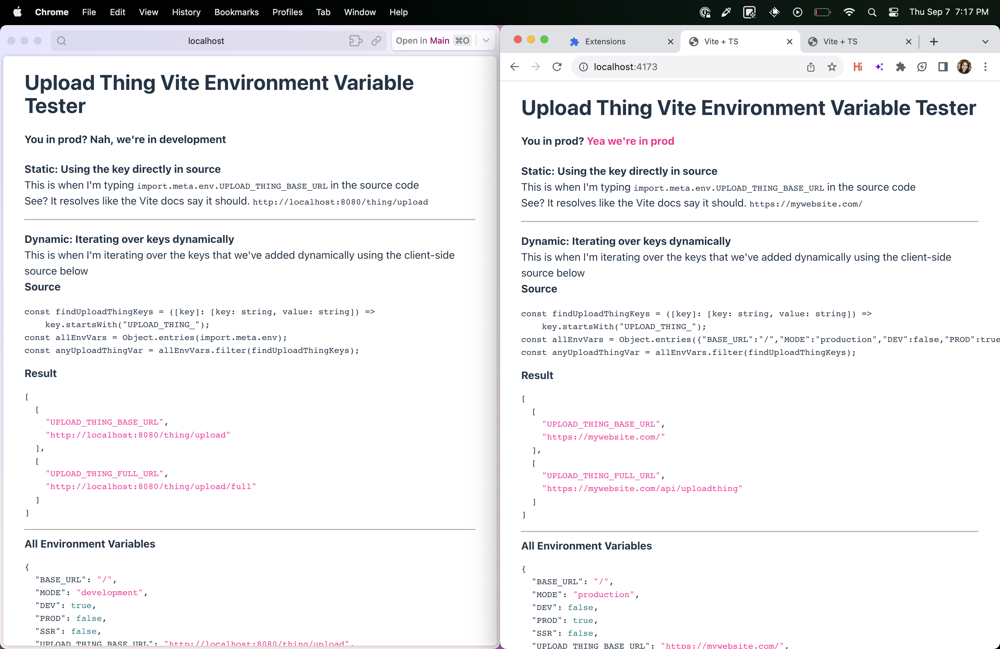
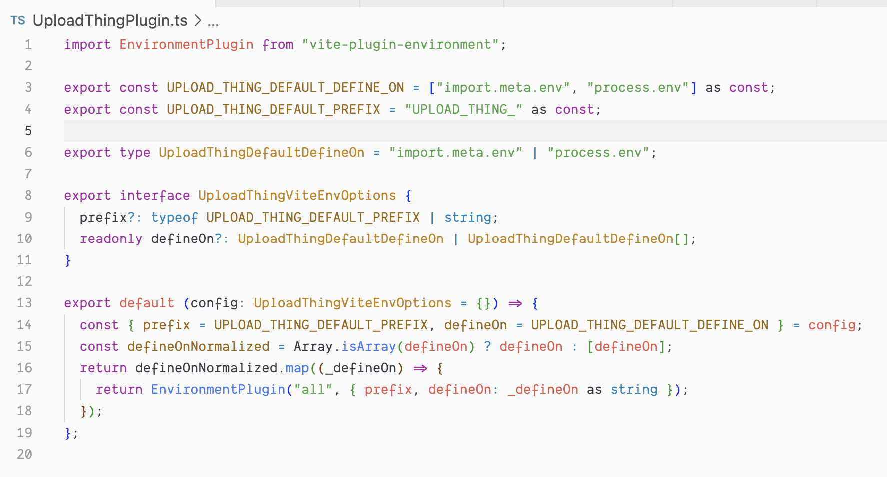
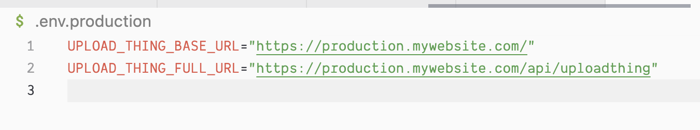

# UploadThing Vite Plugin Demo

#### Playground


#### Plugin Code (it's just dynamically setting `defines` [vite-plugin-environment](https://www.npmjs.com/package/vite-plugin-environment))



#### Env Variables it Slurps Up


## Running it

```bash
pnpm dev # watch the VITE_MODE=dev server and get .env files loaded
pnpm dev:prod # watch the VITE_MODE=production server and get .env.production files loaded

# You might not need these, but they're here
# generate production assets like Vite normally would (basically what I'm doing in dev:prod)
pnpm build

# Host dist
pnpm preview
```
